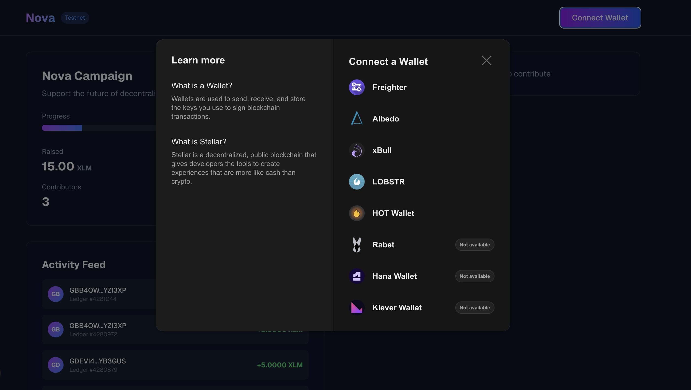
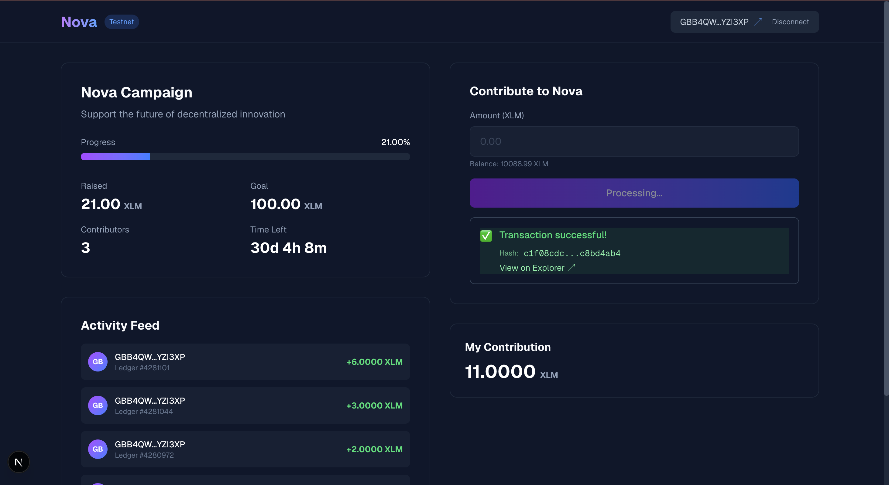
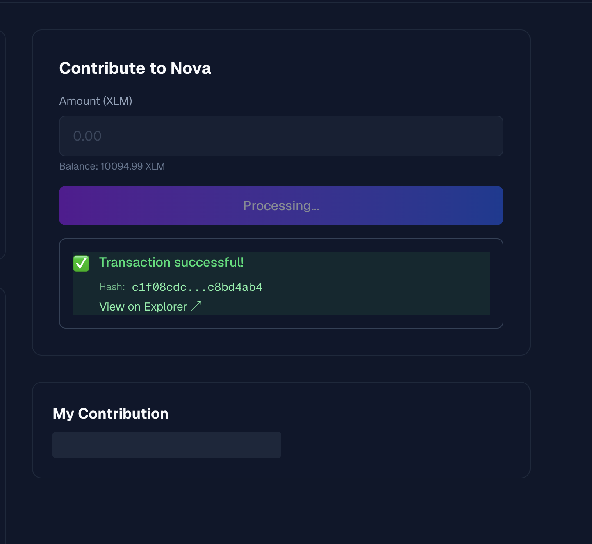

# Nova

A trustless crowdfunding dApp on Stellar testnet built with Soroban smart contracts.

Nova enables decentralized fundraising through a transparent, on-chain campaign system. Contributors send real testnet XLM to the smart contract, which tracks contributions, emits events, and provides real-time updates to the frontend.

## Live Demo

[Deploy on Vercel](#) *(Update with your Vercel URL after deployment)*

## Deployed Contract

**Contract ID:** [`CBZ2FWJBZYQWMYQ3XEXHPY6PFKGRIUDKWDPEDH2QG4RIGD6MQW3NUNQ4`](https://stellar.expert/explorer/testnet/contract/CBZ2FWJBZYQWMYQ3XEXHPY6PFKGRIUDKWDPEDH2QG4RIGD6MQW3NUNQ4)

**Network:** Stellar Testnet

## Transaction Hash

**Contract Call (contribute):** [`3c71ce6bd01a12c9161f4cfafb088019132ff8c4f789771ffc5ebc88b71b0a9d`](https://stellar.expert/explorer/testnet/tx/3c71ce6bd01a12c9161f4cfafb088019132ff8c4f789771ffc5ebc88b71b0a9d)

This transaction demonstrates a successful 5 XLM contribution to the campaign, transferring real testnet XLM via the native asset SAC.

## Tech Stack

### Smart Contract
- **Language:** Rust
- **Framework:** Soroban SDK v22
- **Build Target:** wasm32v1-none
- **Deployment:** Stellar CLI

### Frontend
- **Framework:** Next.js 14+ (App Router)
- **Language:** TypeScript
- **Styling:** Tailwind CSS
- **Wallet Integration:** @creit.tech/stellar-wallets-kit (multi-wallet support)
- **Blockchain SDK:** @stellar/stellar-sdk v13+ (with RPC namespace)
- **Deployment:** Vercel

## Features

- **Multi-Wallet Support:** Connect via Freighter, xBull, Albedo, Rabet, Lobstr, Hana, and more
- **Real-Time Updates:** Live activity feed powered by contract event polling
- **Transaction Status:** Full lifecycle visibility (preparing → signing → pending → success/failed)
- **Campaign Progress:** Live progress bar, contributor count, and countdown timer
- **Error Handling:** Comprehensive error classification (wallet not found, user rejected, insufficient balance, wrong network, campaign ended)
- **Responsive Design:** Mobile-first dark theme with Nova branding

## Setup & Run Locally

### Prerequisites

- Rust 1.84+ with `wasm32v1-none` target
- Stellar CLI (latest)
- Node.js 18+
- npm or yarn
- A Stellar wallet extension (Freighter, xBull, etc.) set to **Testnet**

### Contract Setup

1. **Add the wasm32v1-none target:**
   ```bash
   rustup target add wasm32v1-none
   ```

2. **Build the contract:**
   ```bash
   cd contracts/crowdfund
   stellar contract build
   ```

3. **Generate a deployer identity:**
   ```bash
   stellar keys generate deployer --network testnet --fund
   stellar keys address deployer
   ```

4. **Deploy the contract:**
   ```bash
   stellar contract deploy \
     --wasm target/wasm32v1-none/release/crowdfund.wasm \
     --source-account deployer \
     --network testnet
   ```
   Save the returned contract ID (starts with `C...`).

5. **Get the native XLM SAC address:**
   ```bash
   stellar contract id asset --asset native --network testnet
   ```

6. **Initialize the campaign:**
   ```bash
   stellar contract invoke \
     --id <CONTRACT_ID> \
     --source-account deployer \
     --network testnet \
     -- initialize \
     --beneficiary <deployer G... address> \
     --token <NATIVE_SAC> \
     --goal 1000000000 \
     --deadline 1790035200
   ```

### Frontend Setup

1. **Install dependencies:**
   ```bash
   cd frontend
   npm install
   ```

2. **Configure environment:**
   ```bash
   cp .env.example .env
   ```
   Edit `.env` and fill in:
   - `NEXT_PUBLIC_CONTRACT_ID`: Your deployed contract ID
   - `NEXT_PUBLIC_NATIVE_SAC`: Native XLM SAC address
   - `NEXT_PUBLIC_READ_ACCOUNT`: A funded testnet account (use your deployer address)

3. **Run the development server:**
   ```bash
   npm run dev
   ```

4. **Open your browser:**
   Navigate to `http://localhost:3000`

5. **Fund your wallet:**
   Use the [Stellar Friendbot](https://laboratory.stellar.org/#account-creator) to fund your testnet wallet with XLM.

## How It Works

### Smart Contract

The Nova contract implements a single crowdfunding campaign with the following functions:

- **`initialize`**: Sets up the campaign with beneficiary, token, goal, and deadline (called once after deployment)
- **`contribute`**: Accepts XLM contributions, updates totals, and emits events
- **`get_campaign`**: Returns full campaign state (read-only)
- **`get_contribution`**: Returns an address's total contribution (read-only)
- **`withdraw`**: Allows beneficiary to withdraw funds after goal is met

### Frontend Architecture

1. **Wallet Connection**: StellarWalletsKit provides a modal for multi-wallet selection and signing
2. **Contract Reads**: Use `simulateTransaction` for read-only calls (no fees)
3. **Contract Writes**: Full flow: build → prepare (simulate) → sign → send → poll
4. **Real-Time Events**: Poll `getEvents` every 5 seconds to fetch new contributions
5. **Transaction Status**: State machine tracks preparing → signing → pending → success/failed

### Event-Driven UI

The contract emits `contrib` events on each contribution. The frontend polls these events and:
- Updates the activity feed with new contributions
- Refreshes the campaign progress bar
- Updates the user's contribution total

## Screenshots

### Wallet Options Modal

*Multi-wallet selection via StellarWalletsKit*

### Campaign Progress

*Live progress bar with real-time updates*

### Successful Contribution

*Transaction status with hash and explorer link*

### Activity Feed

*Real-time feed of contributions from contract events*

## Project Structure

```
nova/
├── contracts/
│   └── crowdfund/
│       ├── Cargo.toml
│       ├── Makefile
│       ├── deploy.sh
│       └── src/
│           ├── lib.rs          # Smart contract
│           └── test.rs         # Unit tests
├── frontend/
│   ├── src/
│   │   ├── app/
│   │   │   ├── components/     # UI components
│   │   │   ├── context/        # React context (wallet)
│   │   │   ├── lib/            # Utilities (contract, events, errors)
│   │   │   ├── layout.tsx
│   │   │   ├── page.tsx
│   │   │   └── globals.css
│   ├── .env.example
│   └── package.json
├── docs/
│   └── screenshots/
└── README.md
```

## Testing

### Contract Tests

```bash
cd contracts/crowdfund
cargo test
```

Tests cover:
- Initialization (success and duplicate prevention)
- Contributions (success, multiple, invalid amounts)
- Deadline enforcement
- Event emission

### Manual Testing

1. **Wallet not found**: Try connecting with an uninstalled wallet
2. **User rejected**: Cancel the wallet signature popup
3. **Insufficient balance**: Try contributing more than your wallet balance
4. **Wrong network**: Switch your wallet to Mainnet
5. **Campaign ended**: (After deadline) Try to contribute

## Deployment

### Vercel Deployment

1. Push your code to GitHub
2. Import the repository in Vercel
3. Set environment variables in Vercel project settings:
   - All `NEXT_PUBLIC_*` variables from `.env.example`
4. Deploy

### Contract Deployment

The contract is already deployed to testnet. To redeploy:
```bash
cd contracts/crowdfund
./deploy.sh
```

## License

MIT

## Contributing

Contributions welcome! Please open an issue or PR.

## Support

For issues or questions, please open a GitHub issue.
